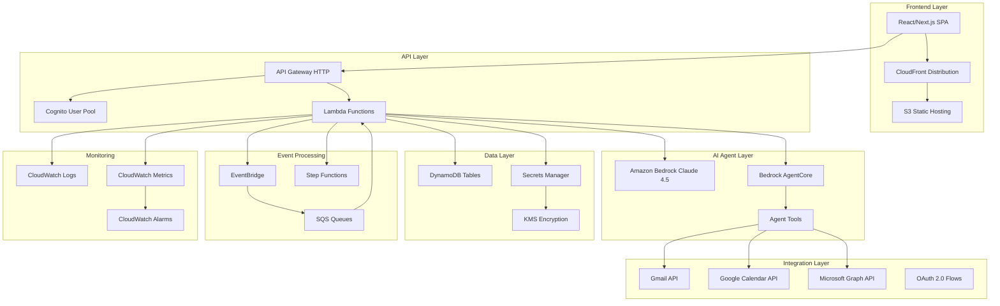

# Design Document

## Overview

The AWS Meeting Scheduling Agent is a serverless, AI-powered system that automates meeting management across Gmail and Outlook calendars. The architecture leverages Amazon Bedrock with Claude Sonnet 4.5 for intelligent decision-making and Amazon Bedrock AgentCore primitives for tool orchestration. The system follows a multi-tier architecture with a React frontend, API Gateway + Lambda backend, and DynamoDB for persistence, all deployed via AWS CDK.

## Architecture

### High-Level System Architecture



### AgentCore Integration Architecture

The system utilizes Amazon Bedrock AgentCore primitives for intelligent tool orchestration:

1. **Router/Planner Primitive**: Determines which tools to invoke based on user requests and current context
2. **Tool Invocation Primitive**: Safely executes calendar and email operations with schema validation
3. **Memory/State Primitive**: Maintains user preferences and meeting context across sessions

## Components and Interfaces

### Frontend Components (TypeScript/React)

#### Core Pages
- **Dashboard Page** (`/dashboard`): Unified calendar view with conflict indicators
- **Connect Page** (`/connect`): OAuth flows for Gmail and Outlook integration
- **Preferences Page** (`/preferences`): User settings and scheduling rules configuration
- **Logs Page** (`/logs`): Agent decision audit trail with natural language explanations

#### Key Components
- **AvailabilityTimeline**: Interactive calendar showing free/busy across all connected accounts
- **ConflictResolver**: UI for reviewing and approving agent-proposed solutions
- **OAuthConnector**: Secure connection flows for Google and Microsoft accounts
- **PreferenceManager**: Forms for working hours, VIP lists, and meeting rules
- **AgentLogger**: Formatted display of agent decisions and rationales

### Backend API Layer (Python/Lambda)

#### Core Lambda Functions

**AuthHandler** (`auth.py`)
- Cognito integration for user authentication
- JWT token validation and user session management
- User profile creation and management

**ConnectionHandler** (`connections.py`)
- OAuth 2.0 flows for Google and Microsoft
- Token storage, refresh, and encryption
- Connection status monitoring and health checks

**AgentHandler** (`agent.py`)
- Bedrock Claude 4.5 integration for AI reasoning
- AgentCore primitive orchestration
- Tool execution coordination and error handling

**CalendarHandler** (`calendar.py`)
- Unified calendar operations across Gmail and Outlook
- Availability aggregation and conflict detection
- Event creation, modification, and deletion

**PreferencesHandler** (`preferences.py`)
- User preference storage and retrieval
- Priority rule management and application
- Working hours and constraint enforcement

#### Agent Tools Implementation

**AvailabilityTool**
```python
def get_availability(range: DateRange, attendees: List[str], 
                    min_duration: int, constraints: Dict) -> List[TimeSlot]:
    """Aggregates availability across all connected calendars"""
```

**EventTool**
```python
def create_event(title: str, start: datetime, end: datetime,
                attendees: List[str], location: str, 
                conference: bool, notes: str) -> EventResult:
    """Creates calendar events with video conferencing"""
```

**RescheduleTool**
```python
def reschedule_event(event_id: str, new_slots: List[TimeSlot],
                    policy: ReschedulePolicy) -> RescheduleResult:
    """Finds optimal rescheduling options"""
```

**EmailTool**
```python
def send_email(to: List[str], subject: str, body: str,
              thread_id: Optional[str]) -> EmailResult:
    """Sends meeting confirmations and updates"""
```

**PreferenceTool**
```python
def extract_preferences(text: str) -> PreferenceUpdate:
    """Extracts scheduling preferences from natural language"""
```

**PrioritizationTool**
```python
def prioritize_meeting(attendees: List[str], subject: str,
                      organizer: str, tags: List[str]) -> PriorityScore:
    """Calculates meeting priority based on rules and ML"""
```

### AgentCore Integration Layer

#### Router/Planner Implementation
```python
class SchedulingPlanner:
    def __init__(self, bedrock_client, agentcore_client):
        self.bedrock = bedrock_client
        self.agentcore = agentcore_client
        
    def plan_action(self, user_request: str, context: Dict) -> ActionPlan:
        """Uses AgentCore router to determine optimal tool sequence"""
        
    def execute_plan(self, plan: ActionPlan) -> ExecutionResult:
        """Orchestrates tool execution via AgentCore primitives"""
```

#### Tool Schema Validation
```python
TOOL_SCHEMAS = {
    "get_availability": {
        "type": "object",
        "properties": {
            "range": {"type": "object", "properties": {...}},
            "attendees": {"type": "array", "items": {"type": "string"}},
            "min_duration": {"type": "integer", "minimum": 15},
            "constraints": {"type": "object"}
        },
        "required": ["range", "min_duration"]
    }
}
```

## Data Models

### DynamoDB Table Schemas

#### Users Table
```python
{
    "pk": "user#12345",  # Partition Key
    "email": "user@example.com",
    "timezone": "America/New_York",
    "created_at": "2024-01-01T00:00:00Z",
    "profile": {
        "name": "John Doe",
        "default_meeting_duration": 30,
        "auto_book_enabled": False
    }
}
```

#### Connections Table
```python
{
    "pk": "user#12345#google",  # Partition Key: userId#provider
    "provider": "google",
    "access_token_encrypted": "...",
    "refresh_token_encrypted": "...",
    "scopes": ["calendar", "gmail.send"],
    "expires_at": "2024-01-01T01:00:00Z",
    "created_at": "2024-01-01T00:00:00Z",
    "last_refresh": "2024-01-01T00:30:00Z"
}
```

#### Preferences Table
```python
{
    "pk": "user#12345",  # Partition Key
    "working_hours": {
        "monday": {"start": "09:00", "end": "17:00"},
        "tuesday": {"start": "09:00", "end": "17:00"},
        # ... other days
    },
    "buffer_minutes": 15,
    "focus_blocks": [
        {"day": "monday", "start": "09:00", "end": "11:00", "title": "Deep Work"}
    ],
    "vip_contacts": ["boss@company.com", "client@important.com"],
    "meeting_types": {
        "standup": {"duration": 15, "priority": "medium"},
        "interview": {"duration": 60, "priority": "high"}
    }
}
```

#### Meetings Table
```python
{
    "pk": "user#12345",  # Partition Key
    "sk": "meeting#event123",  # Sort Key
    "provider_event_id": "google_cal_event_123",
    "provider": "google",
    "title": "Team Standup",
    "start": "2024-01-01T10:00:00Z",
    "end": "2024-01-01T10:30:00Z",
    "attendees": ["team@company.com"],
    "status": "confirmed",
    "priority_score": 0.7,
    "created_by_agent": True,
    "last_modified": "2024-01-01T00:00:00Z"
}
```

#### AgentRuns Table
```python
{
    "pk": "run#abc123",  # Partition Key
    "user_id": "user#12345",
    "request_type": "schedule_meeting",
    "inputs": {
        "attendees": ["colleague@company.com"],
        "duration": 30,
        "subject": "Project Discussion"
    },
    "tools_used": ["get_availability", "create_event", "send_email"],
    "outputs": {
        "event_created": True,
        "event_id": "google_cal_event_123",
        "emails_sent": 2
    },
    "cost_estimate": {
        "bedrock_tokens": 1500,
        "estimated_cost_usd": 0.045
    },
    "execution_time_ms": 2500,
    "created_at": "2024-01-01T00:00:00Z"
}
```

#### AuditLogs Table
```python
{
    "pk": "user#12345",  # Partition Key
    "sk": "2024-01-01T10:30:00Z#step1",  # Sort Key: timestamp#step
    "run_id": "run#abc123",
    "step": "conflict_detection",
    "action": "Found scheduling conflict between Team Standup and Client Call",
    "rationale": "Both meetings scheduled for 10:00 AM on Monday. Team Standup has lower priority (0.7) than Client Call (0.9).",
    "tool_calls": ["get_availability", "prioritize_meeting"],
    "decision": "propose_reschedule",
    "alternatives_proposed": 3,
    "user_action_required": True
}
```

## Error Handling

### Error Categories and Responses

#### Authentication Errors
- **Token Expiration**: Automatic refresh using stored refresh tokens
- **Invalid Credentials**: Clear error messages with re-authentication prompts
- **Scope Insufficient**: Guided re-authorization with required scopes

#### API Integration Errors
- **Rate Limiting**: Exponential backoff with jitter for Google/Microsoft APIs
- **Service Unavailable**: Graceful degradation with cached data when possible
- **Network Timeouts**: Retry logic with circuit breaker pattern

#### Agent Processing Errors
- **Bedrock Throttling**: Queue requests with SQS for retry processing
- **Tool Execution Failures**: Fallback to manual user intervention
- **Invalid Tool Parameters**: Schema validation with clear error messages

#### Data Consistency Errors
- **Concurrent Modifications**: Optimistic locking with DynamoDB conditional writes
- **Stale Calendar Data**: Refresh mechanisms with conflict detection
- **Missing User Preferences**: Sensible defaults with user notification

### Error Recovery Strategies

```python
class ErrorHandler:
    def handle_oauth_error(self, error: OAuthError) -> RecoveryAction:
        """Determines appropriate recovery action for OAuth failures"""
        
    def handle_api_error(self, error: APIError) -> RetryStrategy:
        """Implements exponential backoff and circuit breaker logic"""
        
    def handle_agent_error(self, error: AgentError) -> FallbackAction:
        """Provides graceful degradation for AI processing failures"""
```

## Testing Strategy

### Unit Testing Framework

#### Python Backend Tests
- **pytest** for Lambda function testing
- **moto** for AWS service mocking
- **responses** for external API mocking
- **Coverage target**: 85% code coverage

#### TypeScript Frontend Tests
- **Jest** and **React Testing Library** for component testing
- **MSW** for API mocking
- **Cypress** for integration testing
- **Coverage target**: 80% code coverage

### Integration Testing

#### OAuth Flow Testing
```python
def test_google_oauth_flow():
    """Tests complete Google OAuth authorization and token storage"""
    
def test_microsoft_oauth_flow():
    """Tests complete Microsoft OAuth authorization and token storage"""
    
def test_token_refresh_cycle():
    """Tests automatic token refresh and error handling"""
```

#### Agent Tool Testing
```python
def test_availability_aggregation():
    """Tests calendar availability across multiple providers"""
    
def test_conflict_detection():
    """Tests scheduling conflict identification and resolution"""
    
def test_priority_calculation():
    """Tests meeting prioritization algorithm"""
```

#### End-to-End Testing
```python
def test_complete_scheduling_flow():
    """
    Tests: Connect Gmail → Detect conflict → Propose alternatives → 
    Book meeting → Send confirmations
    """
```

### Performance Testing

#### Load Testing Scenarios
- **Concurrent Users**: 100 simultaneous users scheduling meetings
- **Calendar Sync**: Large calendar datasets (1000+ events)
- **API Rate Limits**: Testing within Google/Microsoft API quotas

#### Bedrock Usage Optimization
- **Token Efficiency**: Minimize prompt tokens while maintaining accuracy
- **Caching Strategy**: Cache frequently accessed calendar data
- **Batch Processing**: Group similar operations to reduce API calls

### Security Testing

#### Authentication Security
- **Token Encryption**: Verify KMS encryption of stored OAuth tokens
- **Session Management**: Test Cognito JWT validation and expiration
- **CSRF Protection**: Validate API Gateway CORS and security headers

#### Data Privacy Testing
- **PII Redaction**: Ensure sensitive data is not logged
- **Access Controls**: Test IAM least-privilege enforcement
- **Audit Trail**: Verify comprehensive logging without data exposure

## Deployment Architecture

### AWS CDK Stack Organization

#### CoreStack
```typescript
export class CoreStack extends Stack {
  // DynamoDB tables with encryption
  // KMS customer-managed keys
  // Cognito User Pool and Identity Pool
  // Secrets Manager for OAuth credentials
}
```

#### ApiStack
```typescript
export class ApiStack extends Stack {
  // API Gateway HTTP API
  // Lambda functions with proper IAM roles
  // Lambda layers for shared dependencies
  // EventBridge rules for periodic processing
}
```

#### WebStack
```typescript
export class WebStack extends Stack {
  // S3 bucket for static hosting
  // CloudFront distribution with security headers
  // Route 53 hosted zone (optional)
  // SSL certificate via ACM
}
```

#### MonitoringStack
```typescript
export class MonitoringStack extends Stack {
  // CloudWatch dashboards
  // Custom metrics and alarms
  // SNS topics for notifications
  // X-Ray tracing configuration
}
```

### Environment Configuration

#### Development Environment
- **Region**: us-east-1 (configurable via CDK context)
- **Bedrock Model**: claude-3-5-sonnet-20241022
- **DynamoDB**: On-demand billing mode
- **Lambda**: ARM64 architecture for cost optimization

#### Production Environment
- **Multi-AZ**: DynamoDB global tables for disaster recovery
- **Auto-scaling**: Lambda concurrency limits and reserved capacity
- **Monitoring**: Enhanced CloudWatch monitoring and alerting
- **Backup**: Point-in-time recovery for DynamoDB tables

### Security Configuration

#### IAM Policies
```json
{
  "Version": "2012-10-17",
  "Statement": [
    {
      "Effect": "Allow",
      "Action": [
        "bedrock:InvokeModel",
        "bedrock:InvokeAgent"
      ],
      "Resource": "arn:aws:bedrock:us-east-1::foundation-model/anthropic.claude-3-5-sonnet-20241022-v2:0"
    }
  ]
}
```

#### KMS Key Policies
- **Separate keys** for different data types (OAuth tokens, user data)
- **Key rotation** enabled with annual rotation
- **Cross-account access** disabled for security

#### Secrets Manager Configuration
- **Automatic rotation** for OAuth client secrets
- **Version management** for credential updates
- **Access logging** for audit compliance

This design provides a comprehensive, secure, and scalable foundation for the AWS Meeting Scheduling Agent that meets all hackathon requirements while following AWS best practices.