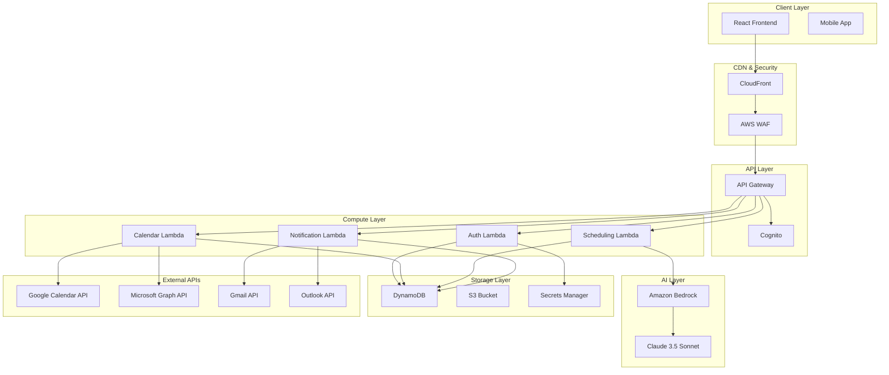
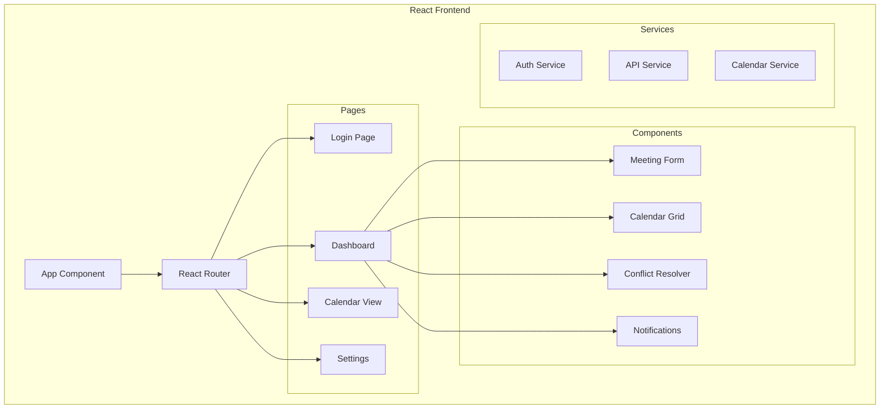

# Architecture Overview

This document provides a comprehensive overview of the AWS Meeting Scheduling Agent architecture, including system components, data flow, and integration patterns.

## System Architecture

### High-Level Architecture


## Compo
nent Architecture

### Frontend Architecture



### Backend Architecture

```mermaid
graph TB
    subgraph "Lambda Functions"
        subgraph "Authentication Service"
            AuthHandler[Auth Handler]
            TokenManager[Token Manager]
            OAuthFlow[OAuth Flow]
        end
        
        subgraph "Calendar Service"
            CalendarSync[Calendar Sync]
            EventManager[Event Manager]
            ConflictDetector[Conflict Detector]
        end
        
        subgraph "Scheduling Service"
            AIScheduler[AI Scheduler]
            PriorityEngine[Priority Engine]
            TimeSlotFinder[Time Slot Finder]
        end
        
        subgraph "Notification Service"
            EmailSender[Email Sender]
            NotificationQueue[Notification Queue]
            TemplateEngine[Template Engine]
        end
    end
    
    AuthHandler --> TokenManager
    TokenManager --> OAuthFlow
    CalendarSync --> EventManager
    EventManager --> ConflictDetector
    AIScheduler --> PriorityEngine
    PriorityEngine --> TimeSlotFinder
    EmailSender --> NotificationQueue
    NotificationQueue --> TemplateEngine
```#
# Data Architecture

### Database Schema

```mermaid
erDiagram
    Users {
        string user_id PK
        string email
        string name
        string timezone
        json preferences
        timestamp created_at
        timestamp updated_at
    }
    
    CalendarConnections {
        string connection_id PK
        string user_id FK
        string provider
        string account_email
        json encrypted_tokens
        boolean is_active
        timestamp last_sync
        timestamp created_at
    }
    
    Meetings {
        string meeting_id PK
        string user_id FK
        string title
        string description
        timestamp start_time
        timestamp end_time
        string timezone
        json attendees
        string status
        json ai_analysis
        timestamp created_at
        timestamp updated_at
    }
    
    MeetingConflicts {
        string conflict_id PK
        string meeting_id FK
        string conflicting_meeting_id FK
        string conflict_type
        json resolution_suggestions
        string status
        timestamp detected_at
        timestamp resolved_at
    }
    
    AuditLogs {
        string log_id PK
        string user_id FK
        string action
        string resource_type
        string resource_id
        json details
        timestamp timestamp
    }
    
    Users ||--o{ CalendarConnections : has
    Users ||--o{ Meetings : creates
    Meetings ||--o{ MeetingConflicts : may_have
    Users ||--o{ AuditLogs : generates
```## S
ecurity Architecture

### Authentication & Authorization Flow

```mermaid
sequenceDiagram
    participant User
    participant Frontend
    participant Cognito
    participant API Gateway
    participant Lambda
    participant External APIs
    
    User->>Frontend: Login Request
    Frontend->>Cognito: Authenticate
    Cognito->>Frontend: JWT Token
    Frontend->>API Gateway: Request + JWT
    API Gateway->>API Gateway: Validate JWT
    API Gateway->>Lambda: Authorized Request
    Lambda->>External APIs: OAuth Token
    External APIs->>Lambda: Data Response
    Lambda->>API Gateway: Processed Response
    API Gateway->>Frontend: API Response
    Frontend->>User: Updated UI
```

## AI Integration Architecture

### Bedrock Integration Flow

```mermaid
graph TB
    subgraph "Input Processing"
        UserRequest[User Request]
        ContextBuilder[Context Builder]
        PromptTemplate[Prompt Template]
    end
    
    subgraph "AI Processing"
        Bedrock[Amazon Bedrock]
        Claude[Claude 3.5 Sonnet]
        ResponseParser[Response Parser]
    end
    
    subgraph "Output Processing"
        Validator[Response Validator]
        Formatter[Response Formatter]
        ActionExecutor[Action Executor]
    end
    
    subgraph "Context Sources"
        CalendarData[Calendar Data]
        UserPrefs[User Preferences]
        MeetingHistory[Meeting History]
        ConflictData[Conflict Data]
    end
    
    UserRequest --> ContextBuilder
    CalendarData --> ContextBuilder
    UserPrefs --> ContextBuilder
    MeetingHistory --> ContextBuilder
    ConflictData --> ContextBuilder
    
    ContextBuilder --> PromptTemplate
    PromptTemplate --> Bedrock
    Bedrock --> Claude
    Claude --> ResponseParser
    
    ResponseParser --> Validator
    Validator --> Formatter
    Formatter --> ActionExecutor
```## Techn
ology Stack

### Frontend Technologies
- **Framework**: React 18 with Next.js 14
- **Styling**: Tailwind CSS
- **State Management**: React Context + Hooks
- **Authentication**: AWS Amplify Auth
- **HTTP Client**: Axios
- **Calendar UI**: React Big Calendar
- **Date Handling**: date-fns
- **Build Tool**: Webpack (via Next.js)

### Backend Technologies
- **Runtime**: Python 3.11
- **Framework**: AWS Lambda + API Gateway
- **Authentication**: Amazon Cognito
- **Database**: Amazon DynamoDB
- **AI/ML**: Amazon Bedrock (Claude 3.5 Sonnet)
- **Caching**: DynamoDB DAX
- **File Storage**: Amazon S3
- **Secrets**: AWS Secrets Manager

### Infrastructure Technologies
- **IaC**: AWS CDK (TypeScript)
- **CI/CD**: GitHub Actions
- **Monitoring**: CloudWatch + X-Ray
- **Security**: AWS WAF + GuardDuty
- **DNS**: Route 53
- **CDN**: CloudFront
- **Certificates**: AWS Certificate Manager

### External Integrations
- **Google APIs**: Calendar API, Gmail API
- **Microsoft APIs**: Graph API (Calendar, Mail)
- **OAuth 2.0**: PKCE implementation
- **Webhooks**: Real-time calendar sync

## Performance Considerations

### Caching Strategy
- **CloudFront**: Static asset caching with 1-year TTL
- **Lambda Memory**: In-memory caching for frequently accessed data
- **DynamoDB DAX**: Microsecond latency for hot data
- **Browser Cache**: Client-side caching for user preferences

### Scalability Patterns
- **Auto Scaling**: Lambda concurrency and DynamoDB auto-scaling
- **Load Distribution**: Multi-region CloudFront distribution
- **Resource Optimization**: Memory tuning and connection pooling
- **Batch Processing**: Efficient bulk operations for calendar sync

## Security Features

### Data Protection
- **Encryption at Rest**: KMS encryption for DynamoDB and S3
- **Encryption in Transit**: TLS 1.3 for all communications
- **Token Security**: Encrypted OAuth tokens in Secrets Manager
- **PII Redaction**: Automatic removal of sensitive data from logs

### Access Control
- **IAM Policies**: Least-privilege access for all resources
- **Cognito Integration**: Centralized user authentication
- **OAuth 2.0 + PKCE**: Secure third-party API access
- **Rate Limiting**: API Gateway throttling and WAF protection

## Monitoring and Observability

### Metrics and Alarms
- **Lambda Performance**: Duration, errors, and throttles
- **API Gateway**: Request count, latency, and error rates
- **DynamoDB**: Read/write capacity and throttling
- **Bedrock Usage**: Token consumption and costs

### Logging Strategy
- **Structured Logging**: JSON format with correlation IDs
- **Log Aggregation**: CloudWatch Logs with retention policies
- **Audit Trail**: Comprehensive user action logging
- **Error Tracking**: Detailed error context and stack traces

## Next Steps

1. Review the [API Documentation](./api-documentation.md) for detailed endpoint specifications
2. Check the [Setup Guide](./setup-deployment.md) for deployment instructions
3. See the [Troubleshooting Guide](./troubleshooting.md) for common issues and solutions