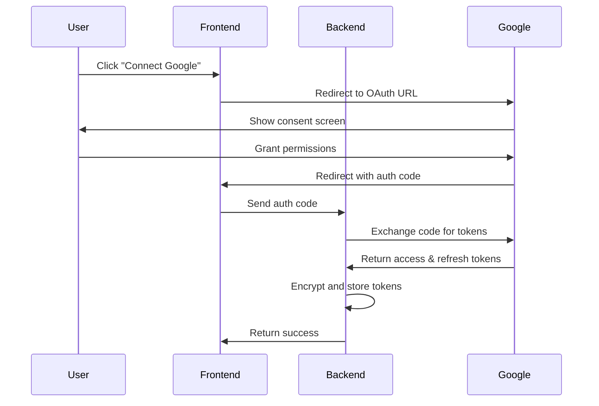
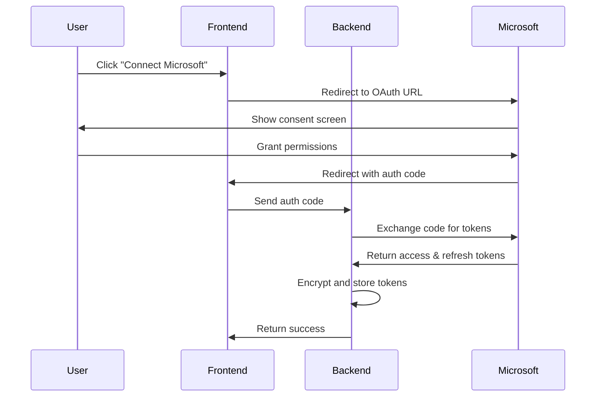

# OAuth Configuration Guide

This guide provides detailed steps for configuring OAuth applications for Google and Microsoft integration.

## Google OAuth Setup

### Step 1: Create Google Cloud Project

1. **Navigate to Google Cloud Console**
   - Go to [Google Cloud Console](https://console.cloud.google.com/)
   - Sign in with your Google account

2. **Create or Select Project**
   - Click the project dropdown at the top
   - Click "New Project" or select an existing project
   - Project name: "AWS Meeting Scheduling Agent"
   - Click "Create"

### Step 2: Enable Required APIs

1. **Navigate to APIs & Services**
   - In the left sidebar, click "APIs & Services" > "Library"

2. **Enable Google Calendar API**
   - Search for "Google Calendar API"
   - Click on it and press "Enable"

3. **Enable Gmail API**
   - Search for "Gmail API"
   - Click on it and press "Enable"

### Step 3: Configure OAuth Consent Screen

1. **Go to OAuth Consent Screen**
   - Navigate to "APIs & Services" > "OAuth consent screen"

2. **Choose User Type**
   - Select "External" (for hackathon/demo purposes)
   - Click "Create"

3. **Fill App Information**
   ```
   App name: AWS Meeting Scheduling Agent
   User support email: your-email@example.com
   Developer contact information: your-email@example.com
   ```

4. **Add Scopes**
   - Click "Add or Remove Scopes"
   - Add the following scopes:
     - `https://www.googleapis.com/auth/calendar`
     - `https://www.googleapis.com/auth/gmail.send`
     - `https://www.googleapis.com/auth/userinfo.email`
     - `https://www.googleapis.com/auth/userinfo.profile`

5. **Add Test Users** (for External apps)
   - Add email addresses that will test the application
   - Include your own email and any demo accounts

### Step 4: Create OAuth 2.0 Credentials

1. **Navigate to Credentials**
   - Go to "APIs & Services" > "Credentials"

2. **Create OAuth Client ID**
   - Click "Create Credentials" > "OAuth 2.0 Client IDs"
   - Application type: "Web application"
   - Name: "AWS Meeting Scheduling Agent Web Client"

3. **Configure Authorized URIs**
   - **Authorized JavaScript origins:**
     ```
     https://your-cloudfront-domain.com
     http://localhost:3000
     ```
   - **Authorized redirect URIs:**
     ```
     https://your-cloudfront-domain.com/auth/google/callback
     http://localhost:3000/auth/google/callback
     ```

4. **Download Credentials**
   - Click "Create"
   - Download the JSON file or copy the Client ID and Client Secret
   - Store these securely - you'll need them for deployment

### Step 5: Verify Configuration

Test the OAuth flow:
```bash
# Test authorization URL generation
curl "https://accounts.google.com/o/oauth2/v2/auth?client_id=YOUR_CLIENT_ID&redirect_uri=http://localhost:3000/auth/google/callback&response_type=code&scope=https://www.googleapis.com/auth/calendar%20https://www.googleapis.com/auth/gmail.send&access_type=offline&prompt=consent"
```

## Microsoft OAuth Setup

### Step 1: Access Azure Portal

1. **Navigate to Azure Portal**
   - Go to [Azure Portal](https://portal.azure.com/)
   - Sign in with your Microsoft account

2. **Navigate to Azure Active Directory**
   - Search for "Azure Active Directory" in the top search bar
   - Click on it

### Step 2: Register Application

1. **Go to App Registrations**
   - In the left sidebar, click "App registrations"

2. **Create New Registration**
   - Click "New registration"
   - Fill in the details:
     ```
     Name: AWS Meeting Scheduling Agent
     Supported account types: Accounts in any organizational directory and personal Microsoft accounts (personal Microsoft accounts and Azure AD accounts)
     Redirect URI: Web - https://your-cloudfront-domain.com/auth/microsoft/callback
     ```
   - Click "Register"

3. **Note Application Details**
   - Copy the "Application (client) ID"
   - Copy the "Directory (tenant) ID"

### Step 3: Configure Authentication

1. **Add Redirect URIs**
   - Go to "Authentication" in the left sidebar
   - Under "Web" platform, add:
     ```
     https://your-cloudfront-domain.com/auth/microsoft/callback
     http://localhost:3000/auth/microsoft/callback
     ```

2. **Configure Advanced Settings**
   - Enable "Access tokens" and "ID tokens"
   - Set "Supported account types" to include personal Microsoft accounts

### Step 4: Configure API Permissions

1. **Navigate to API Permissions**
   - Click "API permissions" in the left sidebar

2. **Add Microsoft Graph Permissions**
   - Click "Add a permission"
   - Select "Microsoft Graph"
   - Choose "Delegated permissions"
   - Add the following permissions:
     ```
     Calendars.ReadWrite - Read and write user calendars
     Mail.Send - Send mail as a user
     User.Read - Sign in and read user profile
     offline_access - Maintain access to data you have given it access to
     ```

3. **Grant Admin Consent** (if required)
   - Click "Grant admin consent for [Your Organization]"
   - Confirm the action

### Step 5: Create Client Secret

1. **Navigate to Certificates & Secrets**
   - Click "Certificates & secrets" in the left sidebar

2. **Create New Client Secret**
   - Click "New client secret"
   - Description: "AWS Meeting Agent Secret"
   - Expires: "24 months" (or as per your security policy)
   - Click "Add"

3. **Copy Secret Value**
   - **Important**: Copy the secret value immediately
   - You won't be able to see it again
   - Store it securely with your other credentials

### Step 6: Verify Configuration

Test the OAuth flow:
```bash
# Test authorization URL generation
curl "https://login.microsoftonline.com/common/oauth2/v2.0/authorize?client_id=YOUR_CLIENT_ID&response_type=code&redirect_uri=http://localhost:3000/auth/microsoft/callback&scope=https://graph.microsoft.com/Calendars.ReadWrite%20https://graph.microsoft.com/Mail.Send%20https://graph.microsoft.com/User.Read%20offline_access&response_mode=query"
```

## Security Best Practices

### OAuth Security Considerations

1. **Use HTTPS Only**
   - Never use HTTP for redirect URIs in production
   - Ensure all OAuth flows use HTTPS

2. **Implement PKCE**
   - Use Proof Key for Code Exchange for additional security
   - Generate code verifier and challenge for each flow

3. **Validate State Parameter**
   - Always include and validate state parameter
   - Prevents CSRF attacks

4. **Secure Token Storage**
   - Store tokens encrypted in DynamoDB
   - Use AWS KMS for encryption keys
   - Never log tokens in plaintext

### Scope Management

**Google Scopes:**
```
https://www.googleapis.com/auth/calendar - Full calendar access
https://www.googleapis.com/auth/gmail.send - Send emails only
https://www.googleapis.com/auth/userinfo.email - User email
https://www.googleapis.com/auth/userinfo.profile - User profile
```

**Microsoft Scopes:**
```
https://graph.microsoft.com/Calendars.ReadWrite - Calendar access
https://graph.microsoft.com/Mail.Send - Send emails
https://graph.microsoft.com/User.Read - User profile
offline_access - Refresh token access
```

## Testing OAuth Integration

### Local Testing Setup

1. **Update Local Environment**
   ```bash
   # frontend/.env.local
   NEXT_PUBLIC_GOOGLE_CLIENT_ID=your-google-client-id
   NEXT_PUBLIC_MICROSOFT_CLIENT_ID=your-microsoft-client-id
   ```

2. **Test OAuth Flows**
   ```bash
   cd frontend
   npm run dev
   
   # Navigate to http://localhost:3000
   # Test Google connection
   # Test Microsoft connection
   ```

### Production Testing

1. **Deploy with OAuth Credentials**
   ```bash
   # Store in AWS Secrets Manager
   aws secretsmanager put-secret-value \
     --secret-id "meeting-agent/google-oauth" \
     --secret-string '{"client_id":"your-client-id","client_secret":"your-client-secret"}'
   ```

2. **Update Redirect URIs**
   - Update Google OAuth app with production CloudFront URL
   - Update Microsoft app registration with production URL

3. **Test End-to-End Flow**
   - Navigate to production URL
   - Complete OAuth flows for both providers
   - Verify token storage and refresh

## Troubleshooting OAuth Issues

### Common Google OAuth Errors

**Error: `redirect_uri_mismatch`**
- Solution: Ensure redirect URI exactly matches what's configured in Google Console
- Check for trailing slashes, HTTP vs HTTPS

**Error: `access_denied`**
- Solution: User denied permission or app not approved
- Check OAuth consent screen configuration

**Error: `invalid_scope`**
- Solution: Requested scope not enabled for the application
- Verify APIs are enabled and scopes are correct

### Common Microsoft OAuth Errors

**Error: `AADSTS50011: The reply URL specified in the request does not match`**
- Solution: Redirect URI mismatch
- Verify exact URL in Azure app registration

**Error: `AADSTS65001: The user or administrator has not consented`**
- Solution: Missing admin consent for required permissions
- Grant admin consent in Azure portal

**Error: `invalid_client`**
- Solution: Client ID or secret is incorrect
- Verify credentials and ensure secret hasn't expired

### Debug OAuth Flows

1. **Enable Debug Logging**
   ```python
   import logging
   logging.basicConfig(level=logging.DEBUG)
   ```

2. **Check Network Requests**
   - Use browser developer tools
   - Monitor OAuth redirect flows
   - Verify authorization codes and tokens

3. **Validate Token Claims**
   ```python
   import jwt
   decoded = jwt.decode(token, options={"verify_signature": False})
   print(decoded)
   ```

## OAuth Flow Diagrams

### Google OAuth Flow


### Microsoft OAuth Flow


## Next Steps

After completing OAuth setup:
1. Deploy the infrastructure with your OAuth credentials
2. Test the complete authentication flow
3. Verify calendar and email integration
4. Review the [API Documentation](./api-documentation.md) for usage details